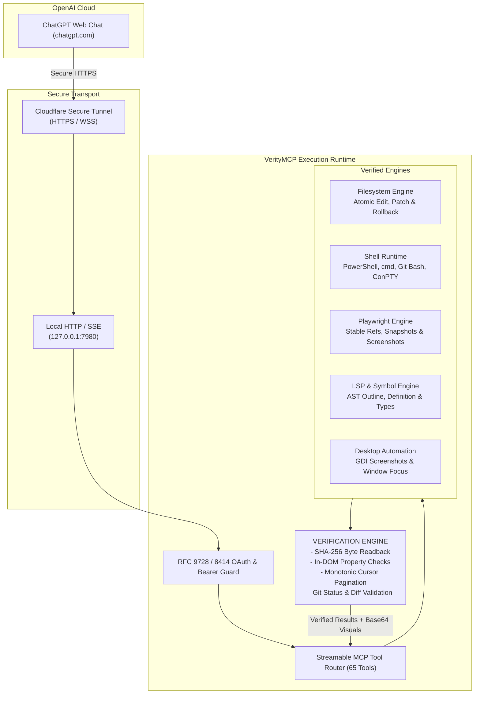

# VerityMCP: Connect ChatGPT Web Directly to Your Local Computer

[](https://modelcontextprotocol.io)
[](https://chatgpt.com)
[](https://nodejs.org)
[](#complete-65-tool-reference)
[](LICENSE)

> **Connect ChatGPT Web Chat directly to your local computer.**  
> Execute terminal commands, edit local files, automate Playwright browsers, inspect desktop windows, and run tests—backed by an ironclad **Verification Engine** that guarantees ChatGPT never hallucinates a successful action.

---

## ⚡ Quickstart: Connect ChatGPT Web in 60 Seconds

Give ChatGPT Web hands-on terminal, code editing, and browser automation capabilities on your local computer with a single click.

### Step 1: Launch VerityMCP
Double-click `start.bat` on Windows (or run `pnpm start` / `npm start` on macOS/Linux):

```cmd
start.bat
```

```text
==========================================================
    VERITY MCP (Verified Local Computer Engineering Layer)    
==========================================================
[Launcher] Starting Cloudflare tunnel on port 7980...

==========================================================
                 CONNECTION READY!                        
==========================================================
  MCP Server URL:   https://neat-agent-tunnel.trycloudflare.com/mcp (COPIED TO CLIPBOARD)
  Owner Token:      NGd1YTHmw_FhX0elAVIEfJ6z-eOUeI-VMzQJweDo38Q
==========================================================
```
> The secure Cloudflare tunnel URL is **automatically copied to your clipboard**!

### Step 2: Add to ChatGPT Web
1. Open [ChatGPT](https://chatgpt.com) in your browser.
2. Go to **Settings** → **Connected Apps** (or **Developer Settings** → **MCP Servers**).
3. Click **Add Server**:
   - **Name**: `Local PC (VerityMCP)`
   - **URL**: Paste the clipboard URL (e.g. `https://neat-agent-tunnel.trycloudflare.com/mcp`)
   - **Authorization**: Enter your `Owner Token` from the terminal window.
4. Click **Save & Connect**.

### Step 3: Tell ChatGPT What to Do!
Ask ChatGPT anything in your chat:
> *"Inspect my current project directory, fix the broken login unit test, run `pnpm test`, and capture a browser screenshot of the web app running on localhost:3000 to verify the fix."*

ChatGPT now interacts with your real local environment in real time, with mathematical proof that every command and file write succeeded.

---

## 🔍 Why Normal MCP Servers Fail (And How VerityMCP Solves It)

Standard MCP servers provide naive wrappers around `fs.writeFile` or `child_process.exec`. When autonomous agents in ChatGPT use them, they constantly hallucinate success:

```
[ChatGPT asks to update file]
Naive MCP Server: "Success!" ───► ChatGPT believes file was changed.
Reality: Hunks did not match, disk file unchanged, build fails later, agent gets stuck in a loop.
```

**VerityMCP is engineered around one primary design law:**
> ### *"AN AGENT MUST BE ABLE TO TRUST ITS TOOLS."*
> A tool returning success when nothing happened is worse than a tool returning an error.

VerityMCP enforces **mandatory pre- and post-condition verification** on every operation:

| Failure in Standard MCP Servers | What Really Happens | How VerityMCP Solves It |
| :--- | :--- | :--- |
| **Silent Patch Failure** | Unified patches with offset hunks return "Success" without altering bytes on disk. | **SHA-256 Readback Assertion**: VerityMCP reads the raw bytes from disk post-mutation, computes SHA-256, and verifies exact equality. Atomically rolls back if mismatched. |
| **Silent Terminal Output Loss** | Long-running processes drop stdout/stderr chunks due to unbuffered closures. | **Durable Chunk Ring Buffering**: Stdout and stderr are stored in persistent memory with monotonic sequence IDs and cursor pagination (`read_process_output`). |
| **Windows Shell Crashes** | MCP servers hardcode `bash`, invoking unconfigured WSL and crashing with `execvpe failed`. | **Windows-First Shell Detection**: Probes PowerShell 7, Windows PowerShell 5.1, cmd.exe, and Git Bash. Provides clear fallback guides if Bash is unavailable. |
| **Visual Blindness** | Reading `.png` / `.jpg` files returns plain text strings (`[Image file: logo.png]`). | **Direct MCP Image Content**: Automatically detects image extensions and returns both metadata AND native base64 `ImageContent` blocks so vision models can see. |
| **Flaky Browser Automation** | Puppeteer/Playwright clicks pass without waiting for DOM hydration. | **Live DOM Readback**: Checks element visibility, fills inputs, and validates actual DOM property values (`inputValue`, `.isChecked()`) before responding. |

---

## 🏛️ Architecture

VerityMCP acts as the secure, high-integrity bridge between ChatGPT and your local machine:



---

## 🛠️ Complete 65-Tool Reference

VerityMCP exposes a unified, production-ready tool surface organized across 12 engineering domains:

### 1. Workspace Onboarding & Repo Map
- `open_workspace`: Opens a local directory or Git repo. In a single call, generates an architectural repo map, Git status/branch, package manifest scripts, detected shells, and discovered project skills.

### 2. Verified Filesystem & Mutations
- `read_file`: Reads files with line slicing (`line_start`, `line_end`) and SHA-256 hash. Returns direct base64 image blocks for visual formats (`.png`, `.jpg`, `.svg`, etc.).
- `write_file`: Atomically writes file content with mandatory post-write byte readback and SHA-256 integrity check.
- `edit_file`: Performs exact-string replacements with occurrence validation, unified diff output, and post-mutation hash checks.
- `apply_patch`: Applies multi-file Codex or unified diffs with atomic staging, automatic rollback on mismatch, and post-write SHA-256 verification.
- `delete_file`: Deletes files or directories with post-unlinking existence confirmation.
- `move_file`: Renames or relocates files with source-removed and destination-verified checks.
- `copy_file`: Duplicates files with byte-for-byte equality verification.
- `list_directory`: Recursively lists directories with depth controls and `.gitignore` parsing.
- `locate_files`: Fast file locator by glob pattern or filename substring.
- `file_metadata`: Inspects file size, line counts, MIME types, timestamps, and SHA-256 hashes.

### 3. Code Search & Structural Intelligence
- `search_code`: Ultra-fast code search powered by native ripgrep with line numbers, regex, and file filtering.
- `get_outline`: Extracts structural symbols (functions, classes, interfaces, methods, types) from code files without reading entire files.

### 4. Language Server Protocol (LSP) Tools
- `lsp_goto_definition`: Jump directly to the declaration location of a symbol.
- `lsp_find_references`: Find all references to a symbol across the entire repository.
- `lsp_hover`: Retrieve type signatures and docstrings at cursor position.
- `lsp_document_symbols`: Extract document symbol hierarchies (`outline`, `normal`, `full`).
- `lsp_workspace_symbols`: Project-wide symbol search by name query.
- `lsp_type_definition`: Navigate directly to symbol type definitions.

### 5. Jupyter Notebook Engine
- `read_notebook`: Structurally parses `.ipynb` files into markdown, code cells, execution counts, and outputs.
- `edit_notebook`: Atomically edits, replaces, inserts, or deletes notebook cells with schema integrity checks.

### 6. Shell, Terminal & Process Runtime
- `exec_command`: Executes commands in explicit shells (`powershell`, `cmd`, `git-bash`). Returns immediately if finished within `yield_ms`, or yields a durable process session ID.
- `read_process_output`: Streams stdout/stderr chunks using cursor pagination without dropping output.
- `write_stdin`: Interacts with running processes via stdin.
- `interrupt_process`: Terminates process trees cleanly using native Windows `taskkill /F /T` or SIGINT.
- `get_environment`: Deep audit of local developer toolchains (Node, pnpm, Python, uv, Git, Docker, shells).

### 7. Playwright Browser Automation
- `browser_navigate`: Navigates persistent browser session to a URL and verifies load status.
- `browser_snapshot`: Builds an accessibility snapshot tree with stable element references (`[ref=e1]`), names, and roles.
- `browser_click`: Clicks element by stable ref or CSS selector.
- `browser_double_click`: Double clicks element.
- `browser_hover`: Triggers hover state.
- `browser_fill`: Types text into form fields with **live DOM `inputValue` readback verification**.
- `browser_check`: Checks or unchecks checkboxes with **live DOM `.isChecked()` assertion**.
- `browser_select_option`: Selects dropdown option by value or label.
- `browser_upload_file`: Uploads local files to file input elements.
- `browser_press_key`: Sends keystrokes (`Enter`, `Tab`, `Escape`, etc.).
- `browser_evaluate`: Evaluates JavaScript inside page context safely.
- `browser_pdf`: Prints current page to a disk PDF file.
- `browser_screenshot`: Captures viewport or full page, verifies the disk file, and returns a direct base64 `ImageContent` block.
- `browser_console_logs`: Inspects real-time browser console warnings, errors, and logs.
- `browser_network_requests`: Inspects HTTP requests made by the page.
- `browser_close`: Closes browser sessions cleanly.

### 8. Desktop Automation (Windows-First)
- `screenshot_desktop`: Captures full screen or region via Windows GDI and returns a direct base64 image block.
- `list_windows`: Enumerates open desktop windows with handles, titles, and process IDs.
- `focus_window`: Brings specific window to the foreground.

### 9. Git & Isolated Worktrees
- `git_status`: Inspects branch name, staged changes, and unstaged modifications.
- `git_diff`: Produces unified diff against HEAD or specified commit.
- `show_changes`: Unified summary of all uncommitted workspace modifications.
- `revert_changes`: Reverts uncommitted changes with post-revert verification.
- `worktree_create`: Creates an isolated Git worktree branch for safe experimentation.
- `worktree_list`: Lists all active Git worktrees.
- `worktree_remove`: Removes worktree with dirty-state safety guard.

### 10. Planning & Bounded Subagents
- `task_create`: Registers a goal in the persistent planning store.
- `task_update`: Updates task state (`pending`, `in_progress`, `completed`, `failed`).
- `task_list`: Inspects all tasks and execution progress.
- `delegate_subagent`: Dispatches a bounded worker subagent with a dedicated persona (`explore`, `coding`, `review`, `verification`, `planning`).
- `list_subagents`: Inspects subagent lifecycles and results.
- `enter_plan_mode` / `exit_plan_mode`: Toggles execution mode boundaries.

### 11. System Diagnostics & Observability
- `devspace_diagnostics`: Returns system health, available shells, browser status, and tool reliability audit logs.

---

## 💻 Configuration Guides

### 1. ChatGPT Web Setup (Recommended)
1. Launch VerityMCP with `start.bat`.
2. Copy the generated Cloudflare URL (`https://<subdomain>.trycloudflare.com/mcp`).
3. In ChatGPT Web, navigate to **Settings** → **Connected Apps** → **Add Server**.
4. Configure:
   - **URL**: `https://<subdomain>.trycloudflare.com/mcp`
   - **Authentication**: Bearer Token
   - **Token**: Copy from your VerityMCP console or `~/.devspace/auth.json`.

### 2. Local IDE & Agent Setup
To run VerityMCP locally with standard MCP clients:
- **Command**: `node "H:/Github Repositories/devspace 4.0/dist/cli.js" serve --port 7980`
- **HTTP / SSE Endpoint**: `http://127.0.0.1:7980/mcp`

---

## 🔒 Security & Local Authority

VerityMCP runs with access to your local machine. We treat security as a first-class product boundary:

1. **Approved Roots Boundary**: File operations are strictly confined within configured directory roots. Attempting path traversal outside allowed boundaries is immediately rejected.
2. **Owner Token Authentication**: The HTTP/SSE endpoint requires Bearer authentication based on RFC 9728 and RFC 8414 standards.
3. **User-Controlled Tunnel**: Tunnels run via Cloudflare's quick tunnel service or local loopback. VerityMCP does not store your credentials on third-party servers.
4. **Isolated Worktrees**: When asking ChatGPT to make large architectural changes, use `worktree_create` to ensure work happens in an isolated Git worktree without touching your main working directory.

---

## 🧪 Testing & Verification

VerityMCP includes a rigorous test suite validating all verification mechanisms:

```bash
pnpm test
```

Test coverage includes:
- `test/patcher.test.ts`: Validates Codex patches, unified diffs, and guarantees prevention of false-success patch mutations.
- `test/process_manager.test.ts`: Verifies durable chunk buffering and cursor pagination under high stdout volume.
- `test/browser.test.ts`: Persistent Playwright browser automation, element refs, verified form inputs, and screenshot generation.
- `test/todomvc.test.ts`: 14-step automated TodoMVC scenario verifying accessibility snapshots, form fill, checkbox assertions, and console logs.
- `test/server.test.ts`: End-to-end HTTP MCP protocol handshake, OAuth metadata endpoints, and tool execution.

---

## ❓ Frequently Asked Questions (FAQ)

### Can ChatGPT Web really edit files on my local Windows PC?
**Yes.** By using the Model Context Protocol (MCP) and a secure tunnel (such as Cloudflare or local reverse proxy), ChatGPT Web can call VerityMCP tools running on your machine to read files, write code, run build scripts, and verify tests.

### How is VerityMCP different from standard MCP servers?
Standard MCP servers are fire-and-forget: they run a command and assume it succeeded. If a file edit doesn't apply cleanly or a test hangs, ChatGPT gets confused and hallucinates. **VerityMCP enforces mathematical verification**—reading back disk bytes via SHA-256 and testing live DOM states before confirming success.

### Do I need to open firewall ports or have a public static IP?
**No.** `start.bat` launches an encrypted Cloudflare Tunnel (`cloudflared`) that establishes an outbound HTTPS tunnel. No port forwarding, DNS configuration, or firewall changes are required.

### Does VerityMCP work on macOS and Linux?
**Yes.** VerityMCP runs on Node.js >= 20 across Windows, macOS, and Linux. On Windows, it includes specialized PowerShell/cmd/Git Bash detection and native GDI desktop tools.

---

## 📄 License

MIT © [Tanishq Baweja](https://github.com/tanishqbaweja)
